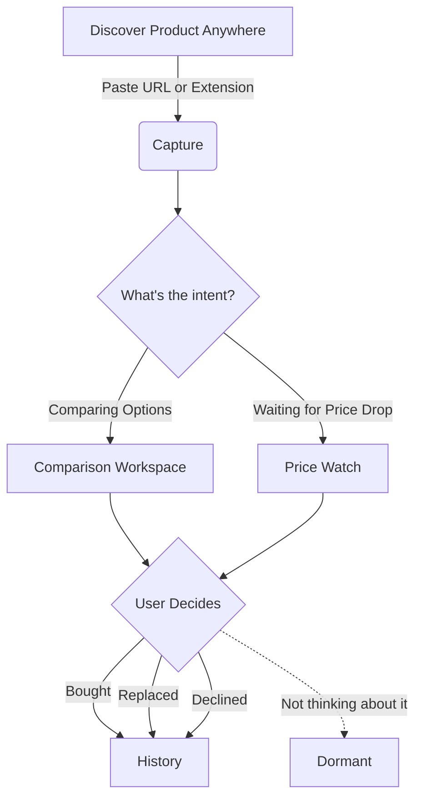

  
# 🛒 TRYBUY
**A purchase-decision workspace for things you want to buy — just not yet.**

[-blue.svg)](#)

*TRYBUY sits exactly between “I want this” and “I’m ready to buy this.”*

---

## 🎯 The Wedge: Saving != Deciding

Modern shopping is scattered. We save items to wishlists, leave tabs open, or send screenshots to ourselves—and quickly lose the context. *Why did I save this? Was I waiting for a discount, or comparing it to something else?*

Existing tools are optimized for **saving products**. TRYBUY treats the **unresolved purchase decision** as the core problem. The user owns the intent; TRYBUY owns the decision memory and workflow.

## ⚙️ How It Works

---

## 🛠 The Two MVP Workflows

### 01. Compare (Without the Noise)
* **The Intent:** *"I like these options, but haven't decided which one."*
* **The Execution:** A side-by-side workspace. No AI recommendations, no "best product" labels, no sponsored rankings. **The user makes the decision.**

### 02. Wait for a Better Price
* **The Intent:** *"I want this, but not at this price."*
* **The Execution:** Stores saved price and target price. A price not changing does *not* automatically resolve the decision—the decision remains active until the user acts.

---

## 🛑 What TRYBUY is NOT

To preserve the integrity of a user-owned decision workspace, the scope firewall is deliberate.

| ❌ We do NOT build... | ✅ Because TRYBUY is... |
| :--- | :--- |
| Marketplaces or endless catalogs | A focused tool for decisions you've already started. |
| Wishlists or Pinterest boards | Built for resolution (Bought/Declined), not endless browsing. |
| AI Recommendation Engines | Opinionated that the **shopper chooses**, not the algorithm. |
| Artificial Urgency (Countdowns) | Respectful of user pacing. Time alone does not create urgency. |

---

## 🧠 The PM Perspective: Validation & Success

TRYBUY is an exploration of a broader product question: **Can software help people *complete* decisions rather than simply generate more engagement?**

<strong>📈 Success Signals (What we want to see)</strong>

* Users return because they have an unfinished decision to finish.
* Using "Dormant" instead of simply abandoning the workspace.
* Adding alternative products to existing comparison sets.
* Users reporting that TRYBUY replaces screenshots/tabs for this specific workflow.

<strong>🚩 Failure Conditions (When to pivot/kill)</strong>

* **It's just another wishlist:** Users save products but never interact with workflows.
* **Comparison isn't meaningful:** Users rarely add multiple products or resolve sets.
* **Price watching dominates:** The product becomes just a generic price tracker.
* **Capture friction:** If getting a product into TRYBUY is too annoying, the decision-management never gets a chance to matter.

---

## 🏗 Technical Architecture & Capture

Designed deliberately lightweight to validate behavior before scaling infrastructure.

* **Stack:** React 19, TypeScript, Vite, Tailwind CSS, Zustand, Local Storage.
* **Architecture:** No backend database for Stage-0. State is purely local.
* **Capture Philosophy:** *Honest Extraction.* We use best-effort URL enrichment (OG/JSON-LD). If data is unavailable, we say so rather than fabricating `$0.00`.
* **Extension Spike:** Includes a Chrome Extension (Manifest V3) specifically built to unblock capture on fortified SPAs (like Myntra/Amazon) via strict identity validation.

   
  <i>"Shopping doesn't always fail because people can't find products. Sometimes it fails because they never finish deciding."</i>

